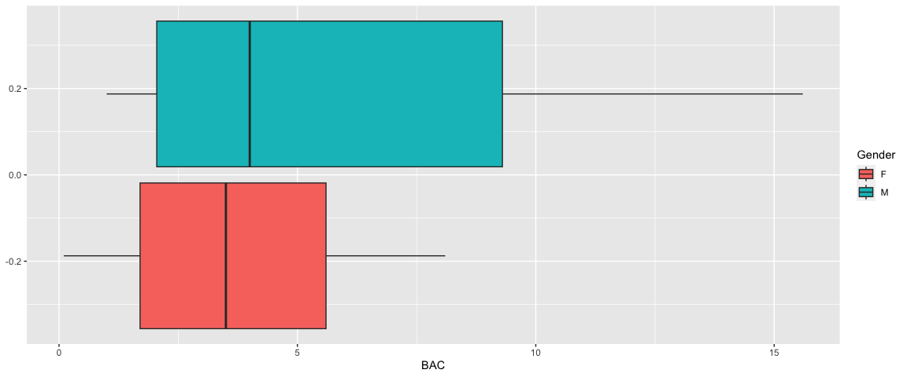
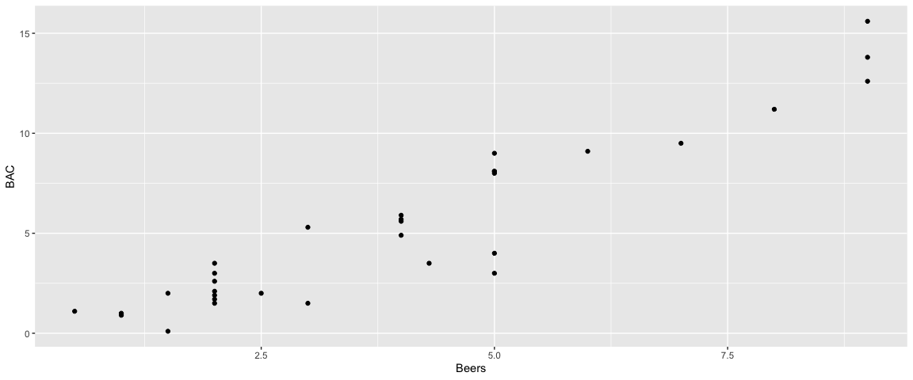

Blood Alcohol Content
================
Cian Mac Liatháin

## Introduction

How well does the number of beers a student drinks predict their blood
alcohol content?

The following research questions are of interest:

- Is there evidence to suggest a difference in the typical blood alcohol
  content (BAC) between the male student population and female student
  population.
- Explore the relationship between blood alcohol content (BAC) and the
  number of beers consumed (Beers) with correlation analysis.
- Fit a linear regression model to the relationship between blood
  alcohol content (BAC) and the number of beers (Beers), interpreting
  the fitted values in the estimated relationship. Comment on the
  significance of the estimated effect. Use the estimated relationship
  to find the fitted value of blood alcohol content when the number of
  beers consumed is 5.

## Subjective Impression

A sample of, very willing, volunteers drank a randomly assigned number
of cans of a certain brand of beer.A number of hours later a police
officer measured their blood alcohol content, BAC. The gender of
participants was also recorded.

To investigate if any difference exists when comparing BAC by gender the
following output provides some summary statistics and graphical displays
for the female and male samples for comparison.

``` r
BAdata%>%group_by(Gender)%>%summarise(n=n(),mean=mean(BAC),median=median(BAC), sd=sd(BAC), min= min(BAC),  max=max(BAC))
```

    # A tibble: 2 × 7
      Gender     n  mean median    sd   min   max
      <chr>  <int> <dbl>  <dbl> <dbl> <dbl> <dbl>
    1 F         13  3.91    3.5  2.61   0.1   8.1
    2 M         19  6.16    4    4.77   1    15.6

``` r
ggplot(BAdata,aes(y=BAC,fill=Gender))+geom_boxplot()+coord_flip()
```

<!-- -->

We can see from the summary statistics that there was higher blood
alcohol content (BAC) found in the male sample than the female, with a
mean of 6.157895 in males compared to a mean of 3.907692 in females.
More variance is also seen in the males, with a higher standard
deviation of 4.768218 compared to the females’ 2.606230.

It is evident from the box plots that both the male and female samples
are positively skewed, and the male sample has a higher range of blood
alcohol content (BAC) of 14.6 compared to the females’ range of 8, both
samples have no obvious outliers.

To explore the relationship between blood alcohol content (BAC) and the
number of beers consumed (Beers), a scatterplot and Pearson correlation
coefficient for the sample is produced.

``` r
ggplot(BAdata,aes(x=Beers,y=BAC))+geom_point()
```

<!-- -->

``` r
cor(BAdata$BAC,BAdata$Beers)
```

    [1] 0.940536

It is visually evident from the scatterplot that there is a positive
linear relationship between blood alcohol content (BAC) and beers
consumed (Beers), with an observed Pearson correlation coefficient of
0.940536, indicating a strong positive relationship in the sample
between the two variables.

## Formal Analysis

A hypothesis test is carried out to determine if the sample gives
evidence to suggest a difference in the typical blood alcohol content
(BAC) between the male student population and female student population.

Since both sample sizes are small, it is important to assess the
normality of the population of male and female blood alcohol content
(BAC), to know whether a t-test is applicable. This can be done using an
Anderson-Darling normality test.

``` r
maleBAC <- BAdata %>% filter(Gender == "M") %>% pull(BAC)
femaleBAC <- BAdata %>% filter(Gender == "F") %>% pull(BAC)

ad.test(maleBAC)
```


        Anderson-Darling normality test

    data:  maleBAC
    A = 0.87674, p-value = 0.01975

``` r
ad.test(femaleBAC)
```


        Anderson-Darling normality test

    data:  femaleBAC
    A = 0.29895, p-value = 0.5324

With a p-value of 0.5324, there is no evidence to reject the null
hypotheses for the female population. However, the male p-value of
0.01975 is small enough to reject the null hypothesis, and suggests that
the distribution of blood alcohol content (BAC) in the male population
may depart from normality.

Since a 2-sample t-test assumes normality in both populations, it would
not be appropriate to use in this case. Instead, we can compare the
estimated median value of blood alcohol content (BAC) in the male
student population and female student estimated population using a
Wilcoxon Rank Sum Test, which does not assume normality in the data.

``` r
 wilcox.test(BAC~Gender,BAdata,conf.level=0.95,correct=F)
```


        Wilcoxon rank sum test

    data:  BAC by Gender
    W = 90.5, p-value = 0.2052
    alternative hypothesis: true location shift is not equal to 0

The p-value of 0.2052 indicates there is no evidence of a difference
comparing the median blood alcohol content (BAC) for the population of
all male students and the median blood alcohol content (BAC) for the
population of all female students.

A linear regression model is fitted to the sample data to explain the
variability in the response blood alcohol level with the predictor
number of beers consumed.

``` r
fit<-lm(BAC~Beers,BAdata)
summary(fit)
```


    Call:
    lm(formula = BAC ~ Beers, data = BAdata)

    Residuals:
        Min      1Q  Median      3Q     Max 
    -3.9200 -0.6138  0.3592  0.9113  2.3132 

    Coefficients:
                Estimate Std. Error t value Pr(>|t|)    
    (Intercept)  -1.0385     0.4851  -2.141   0.0405 *  
    Beers         1.5917     0.1050  15.165 1.31e-15 ***
    ---
    Signif. codes:  0 '***' 0.001 '**' 0.01 '*' 0.05 '.' 0.1 ' ' 1

    Residual standard error: 1.428 on 30 degrees of freedom
    Multiple R-squared:  0.8846,    Adjusted R-squared:  0.8808 
    F-statistic:   230 on 1 and 30 DF,  p-value: 1.31e-15

``` r
anova(fit)
```

    Analysis of Variance Table

    Response: BAC
              Df Sum Sq Mean Sq F value   Pr(>F)    
    Beers      1 468.70  468.70  229.98 1.31e-15 ***
    Residuals 30  61.14    2.04                     
    ---
    Signif. codes:  0 '***' 0.001 '**' 0.01 '*' 0.05 '.' 0.1 ' ' 1

Interpretation of the fitted model:

When beers consumed (Beers) is 0, blood alcohol content (BAC) is
estimated to be -1.0385. As beers consumed (Beers) increases by 1, blood
alcohol content (BAC) increases by 1.5917 on average.

The coefficient of determination for the model with predictor beers
consumed (Beers) is 0.8846, i.e. 88.46% of the variability observed in
the response variable blood alcohol content (BAC), is explained by the
model with predictor beers consumed (Beers).

Inference:  
The ANOVA test statistic is 229.98 with p-value printed as 1.31e-15.
Since this p-value is small there is evidence to reject the null
hypothesis, there is evidence to suggest the model with predictor Beers
is explaining the variability in the response variable BAC in the
population.

The t-test test statistic is 15.165 with p-value printed as 1.31E-15.
Since this p-value is small there is evidence to reject the null
hypothesis, there is evidence to suggest beers consumed (Beers) is a
good predictor of the response variable blood alcohol content (BAC) in
the population.

The estimated relationship is used to find the fitted value of blood
alcohol content when the number of beers consumed is 5. A prediction
interval and confidence interval is provided.

``` r
predict(fit, new=data.frame(Beers=c(5))   ,interval="prediction")
```

           fit      lwr      upr
    1 6.920011 3.950714 9.889308

``` r
predict(fit, new=data.frame(Beers=c(5))   ,interval="confidence")
```

           fit     lwr      upr
    1 6.920011 6.35735 7.482672

When beers consumed is 5, blood alcohol content is estimated to be
6.920011 on average. For an individual student who has consumed 5 beers,
predicted response blood alcohol content is estimated to be between
3.950714 and 9.889308.  
For all student consumption being 5 beers, average blood alcohol content
is estimated to be between 6.35735 and 7.482672.
