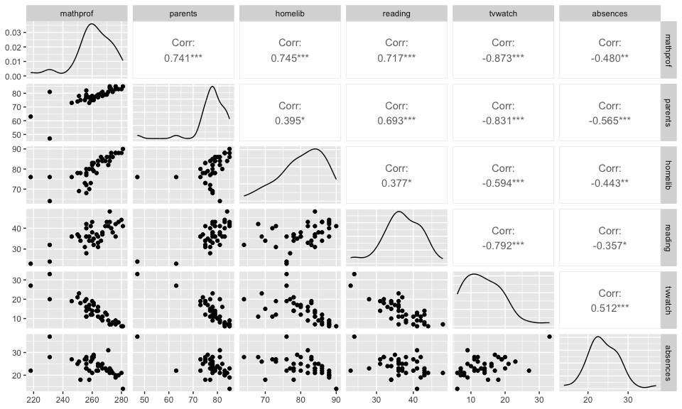

Exploring Mathematics Proficiency
================
Author: Cian Mac Liatháin

# Introduction

Data obtained from a study investigating the relationship of educational
achievement of students to their home environment included measurements
for a sample of 35 school districts of average mathematics proficiency
Mathprof. In order to investigate what variables may predict mathematics
proficiency five candidate explanatory variables are considered:

- parents, the percentage of students with both parents living at home.
- homelib, the percentage of students with three or more types of
  reading materials at home (books, encyclopedias, magazines, newspapers
  etc),
- reading, the percentage of students who read more than 10 pages a day.
- tvwatch, the percentage of students who watch TV for six hours or more
  per day,
- absences, the percentage of students absent three days or more in the
  previous month,

# Subjective Impression

The descriptive statistics and plots below summarise the sampled
measurements.

``` r
ggpairs(mathprofdata)
```

<!-- -->

The observed Pearson correlation coefficient for the percentage of
students with both parents living at home (parents) and average
mathematical proficiency of the school district (mathprof) is 0.741.
Since this is close to 1 in magnitude and positive in value this
indicates a strong increasing linear relationship in the sample.

The observed Pearson correlation coefficient for the percentage of
students with three or more types of reading materials at home (homelib)
and average mathematical proficiency of the school district (mathprof)
is 0.745. Since this is close to 1 in magnitude and positive in value
this indicates a strong increasing linear relationship in the sample.

The observed Pearson correlation coefficient for the percentage of
students who read more than 10 pages per day (reading) and average
mathematical proficiency of the school district (mathprof) is 0.717.
Since this is close to 1 in magnitude and positive in value this
indicates a strong increasing linear relationship in the sample.

The observed Pearson correlation coefficient for the percentage of
students who watch TV for 6 hours or more per day (tvwatch) and average
mathematical proficiency of the school district (mathprof) is -0.873
Since this is close to 1 in magnitude and negative in value this
indicates a strong decreasing linear relationship in the sample.

The observed Pearson correlation coefficient for the percentage of
students who were absent 3 or more days in the previous month (absences)
and average mathematical proficiency of the school district (mathprof)
is -0.480. Since this is less than 0.5 in magnitude and negative in
value this indicates a moderate decreasing linear relationship in the
sample.

# Formal Analysis

Fitting a multiple linear regression model with all five of the
candidate predictors to the sample data gives the following output:

``` r
fit<-lm(mathprof~parents+homelib+reading+tvwatch+absences,mathprofdata)
summary(fit)
```


    Call:
    lm(formula = mathprof ~ parents + homelib + reading + tvwatch + 
        absences, data = mathprofdata)

    Residuals:
         Min       1Q   Median       3Q      Max 
    -17.0131  -2.9395   0.4694   2.5336   9.3248 

    Coefficients:
                Estimate Std. Error t value Pr(>|t|)    
    (Intercept) 155.0304    36.2383   4.278 0.000145 ***
    parents       0.3911     0.2571   1.521 0.137399    
    homelib       0.8639     0.1797   4.807 3.05e-05 ***
    reading       0.3616     0.2690   1.345 0.187679    
    tvwatch      -0.8467     0.3525  -2.402 0.021927 *  
    absences      0.1923     0.2636   0.729 0.470718    
    ---
    Signif. codes:  0 '***' 0.001 '**' 0.01 '*' 0.05 '.' 0.1 ' ' 1

    Residual standard error: 5.268 on 34 degrees of freedom
    Multiple R-squared:  0.861, Adjusted R-squared:  0.8406 
    F-statistic: 42.13 on 5 and 34 DF,  p-value: 1.276e-13

**Interpretation of the fitted model:**

When all of the explanatory variables (parents, homelib, reading,
tvwatch, absences) have value 0, mathematical proficiency (mathprof) is
estimated to be 155.0304 on average.

For each percentage increase of students in the school district who have
both parents living at home (parents), mathematical proficiency
increases by 0.3911 on average, holding the other explanatory variables
(homelib, reading, tvwatch, absences) constant.

For each percentage increase of students in the school district with
three or more types of reading materials at home (homelib), mathematical
proficiency increases by 0.8639 on average, holding the other
explanatory variables (parents, reading, tvwatch, absences) constant.

For each percentage increase of students in the school district who read
more than 10 pages per day (reading), mathematical proficiency increases
by 0.3616 on average, holding the other explanatory variables (parents,
homelib, tvwatch, absences) constant.

For each percentage increase of students in the school district who
watch TV for 6 hours or more per day (tvwatch), mathematical proficiency
decreases by -0.8467 on average, holding the other explanatory variables
(parents, homelib, reading, absences) constant.

For each percentage increase of students in the school district who were
absent 3 or more days in the previous month (absences), mathematical
proficiency increases by 0.1923 on average, holding the other
explanatory variables (parents, homelib, reading, tvwatch) constant.

The coefficient of determination for the model with the five predictor
variables is 0.861, i.e. 86.1% of the variability observed in the
response variable mathematical proficiency in the sample, is explained
by the model with predictors parents, homelib, reading, tvwatch and
absences.

**Inference:**

The ANOVA test statistic has value 42.13 with a p-value of 1.276e-13.
The p-value is small, there is evidence to reject the null hypothesis,
there is evidence to suggest the model with parents, homelib, reading,
tvwatch and absences is explaining the variability in average
mathematical proficiency of a school district in the population, i.e. at
least one good predictor in the model.

The t-test for the coefficient of parents gives a test statistic of
1.521 and p-value 0.137399. The p-value is large, there is no evidence
to reject the null hypothesis, there is no evidence to suggest that
percentage of students with both parents living at home is a good
predictor of the average mathematical proficiency of a school district
in the population.

The t-test for the coefficient of homelib gives a test statistic of
4.807 and p-value 3.05e-05 The p-value is small, there is evidence to
reject the null hypothesis, there is evidence to suggest that percentage
of students with three or more types of reading materials at home is a
good predictor of the average mathematical proficiency of a school
district in the population.

The t-test for the coefficient of reading gives a test statistic of
1.345 and p-value 0.187679 The p-value is large, there is no evidence to
reject the null hypothesis, there is no evidence to suggest that
percentage of students who read more than 10 pages per day is a good
predictor of the average mathematical proficiency of a school district
in the population.

The t-test for the coefficient of tvwatch gives a test statistic of
-2.402 and p-value 0.021927 The p-value is small, there is evidence to
reject the null hypothesis, there is evidence to suggest that percentage
of students who watch more than 6 hours of television per day is a good
predictor of the average mathematical proficiency of a school district
in the population.

The t-test for the coefficient of absences gives a test statistic of
0.729 and p-value 0.470718 The p-value is large, there is no evidence to
reject the null hypothesis, there is no evidence to suggest that
percentage of students who were absent 3 or more days in the previous
month is a good predictor of the average mathematical proficiency of a
school district in the population.
