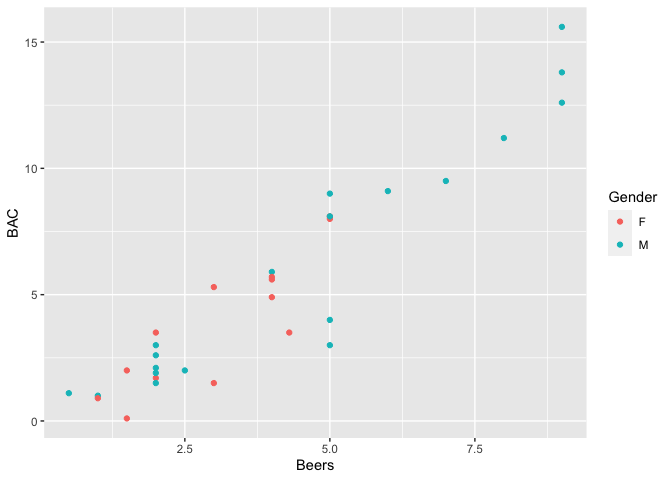

Blood Alcohol Content
================
Author: Cian Mac Liatháin

## Introduction

How well does the number of beers a student drinks predict their blood
alcohol content?

The following research questions are of interest:

Compare the relationship between blood alcohol content (BAC) and the
number of beers consumed (Beers) between the population of males and the
population of females.

## Subjective Impression

A sample of, very willing, volunteers drank a randomly assigned number
of cans of a certain brand of beer. A number of hours later a police
officer measured their blood alcohol content, BAC. The gender of
participants was also recorded.

To explore the relationship between blood alcohol content (BAC) and the
number of beers consumed (Beers), indicating which observations are from
each gender.

``` r
ggplot(BAdata,aes(x=Beers,y=BAC,colour=Gender))+geom_point()
```

<!-- -->

## Formal Analysis

A linear regression model is fitted to the sample data to explain the
variability in the response blood alcohol level with two predictors, the
number of beers consumed and gender, i.e. the following model
specification:

$BAC_i=\beta_0+\beta_1Beers_i+\beta_2Gender_i+\epsilon_i$

``` r
fit<-lm(BAC~Beers+Gender,data=BAdata)
summary(fit)
```


    Call:
    lm(formula = BAC ~ Beers + Gender, data = BAdata)

    Residuals:
        Min      1Q  Median      3Q     Max 
    -3.9125 -0.6072  0.3481  0.9163  2.3155 

    Coefficients:
                Estimate Std. Error t value Pr(>|t|)    
    (Intercept) -1.03063    0.53088  -1.941    0.062 .  
    Beers        1.59301    0.11159  14.276  1.2e-14 ***
    GenderM     -0.02193    0.54631  -0.040    0.968    
    ---
    Signif. codes:  0 '***' 0.001 '**' 0.01 '*' 0.05 '.' 0.1 ' ' 1

    Residual standard error: 1.452 on 29 degrees of freedom
    Multiple R-squared:  0.8846,    Adjusted R-squared:  0.8767 
    F-statistic: 111.2 on 2 and 29 DF,  p-value: 2.519e-14

Interpretation:

In the model, GenderM is an indicator variable taking value 1 for
students that are male, and 0 for students that are female.

The constant $\beta_0$, -1.03063: when Beers=0 and GenderM=0. The blood
alcohol level of female students without any beers consumed is estimated
to be -1.03063, on average.

Coefficient $\beta_1$ of the predictor variable Beers, 1.59301: the
blood alcohol level of both female and male students is estimated to
increase by 1.59301 for each additional beer consumed, on average.

Coefficient $\beta_2$ of the predictor variable GenderM, -0.02193: this
is the difference on average in the blood alcohol level between female
and male students, - i.e. the blood alcohol level of male students is
less on average than female students by 0.02193.

Inference:

Testing for non zero coefficient $\beta_1$ of predictor Beers, the
estimated effect is 1.59301, with standard error 0.11159, the test
statistic is 14.276, with p-value \<0.0001. There is evidence to reject
the null hypothesis and evidence to suggest the true coefficient of
Beers is not equal to 0, i.e. the effect of beers consumed on blood
alcohol level is significant in the population.

Testing for non zero coefficient $\beta_2$ of the indicator variable
GenderM, the estimated effect is -0.02193, with standard error
0.54631,the test statistic is -0.040, with p-value 0.968 There is no
evidence to reject the null hypothesis and no evidence to suggest the
true coefficient of GenderM is not equal to 0, no evidence of a
difference average blood alcohol level comparing male and female
students in the population.
