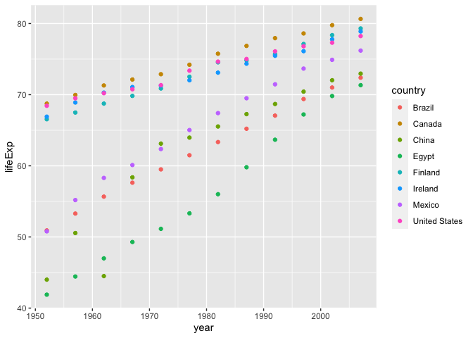

Gapminder: Trends in Life Expentancy, Ireland and China - a comparison.
================
Author: Cian Mac Liatháin

## Introduction

A study into changes in socio-economic development recorded a number of
variables:

- lifeExp: life expectancy of a newborn child
- year: year of measurement
- time: time of measurement coded as number of years since 1950.
- country: country of measurement

## Subjective Impression

To investigate if any difference exists in the change in life expectancy
over time comparing countries. The following output provides some
summary statistics and graphical displays for the different countries.

``` r
gapminder%>%group_by(country) %>% summarise(n(),mean(lifeExp),median(lifeExp),sd(lifeExp))
```

    # A tibble: 8 × 5
      country       `n()` `mean(lifeExp)` `median(lifeExp)` `sd(lifeExp)`
      <chr>         <int>           <dbl>             <dbl>         <dbl>
    1 Brazil           12            62.2              62.4          7.04
    2 Canada           12            74.9              75.0          3.95
    3 China            12            61.8              64.8         10.3 
    4 Egypt            12            56.2              54.7         10.1 
    5 Finland          12            73.0              73.5          4.30
    6 Ireland          12            73.0              72.6          3.62
    7 Mexico           12            65.4              66.2          8.19
    8 United States    12            73.5              74.0          3.34

``` r
ggplot(gapminder,aes(x=year,y=lifeExp, colour=country))+geom_point()
```

<!-- -->

## Formal Analysis

Focus in this report is given to comparing two countries: Ireland and
China.

A linear regression model is fitted to the sample data to explain the
variability in the response variable, life expectancy (lifeExp), with
two predictors, time since 1950 (time) and the country (country).

``` r
data<-gapminder%>%filter(country%in%c("Ireland","China"))
fit<-lm(lifeExp~time+country,data=data)
summary(fit)
```


    Call:
    lm(formula = lifeExp ~ time + country, data = data)

    Residuals:
        Min      1Q  Median      3Q     Max 
    -10.899  -2.338   1.147   2.768   4.094 

    Coefficients:
                   Estimate Std. Error t value Pr(>|t|)    
    (Intercept)    51.02019    1.84241  27.692  < 2e-16 ***
    time            0.36494    0.04812   7.584 1.92e-07 ***
    countryIreland 11.23167    1.66106   6.762 1.09e-06 ***
    ---
    Signif. codes:  0 '***' 0.001 '**' 0.01 '*' 0.05 '.' 0.1 ' ' 1

    Residual standard error: 4.069 on 21 degrees of freedom
    Multiple R-squared:  0.831, Adjusted R-squared:  0.8149 
    F-statistic: 51.62 on 2 and 21 DF,  p-value: 7.825e-09

In the model, countryIreland is an indicator variable taking value 1 for
when the country is Ireland and 0 for when the country is not, in this
case a value of 0 indicates the country is China.

Interpretation:

- The constant when indicator variable countryIreland=0 and when
  indicator variable time=0 is 51.02019, indicating that the average
  life expectancy of a newborn child in China in 1950 is 51.02019 years
  old.

- Coefficient of the predictor variable time, 0.36494 : for each
  additional year in time since 1950, the life expectancy of a newborn
  child increases by 0.36494 years of age on average,in both countries.

- Coefficient of the predictor variable countryIreland, 11.23167: this
  is the difference on average in life expectancy between newborn
  children in Ireland and China - i.e. the life expectancy of newborn
  children in Ireland is greater than newborn children in China by
  11.23167 years of age on average.

Inference:

Testing for non zero coefficient of predictor time, the estimated effect
is 0.36494, with standard error 0.04812, the test statistic is 7.584,
with p-value \< 0.0001. There is evidence to reject the null hypothesis
and evidence to suggest the true coefficient of predictor time is not
equal to 0, i.e. the effect of years since 1950 on the life expectancy
of newborn children is significant in the population.

Testing for non zero coefficient of the indicator variable
countryIreland, the estimated effect is 11.23167, with standard error
1.66106,the test statistic is 6.762, with p-value \< 0.0001. There is
evidence to reject the null hypothesis and evidence to suggest the true
coefficient of predictor countryIreland is not equal to 0, evidence of a
difference in newborn children’s life expectancy comparing those born in
Ireland to those born in China in the population.

The linear regression model is adapted to incorporate an interaction
term for the two predictors.

``` r
fit<-lm(lifeExp~time*country,data=data)
summary(fit)
```


    Call:
    lm(formula = lifeExp ~ time * country, data = data)

    Residuals:
        Min      1Q  Median      3Q     Max 
    -7.9980 -0.5250  0.1166  0.7186  5.3147 

    Coefficients:
                        Estimate Std. Error t value Pr(>|t|)    
    (Intercept)         46.12917    1.57122  29.359  < 2e-16 ***
    time                 0.53073    0.04597  11.545 2.68e-10 ***
    countryIreland      21.01370    2.22204   9.457 8.02e-09 ***
    time:countryIreland -0.33159    0.06501  -5.100 5.46e-05 ***
    ---
    Signif. codes:  0 '***' 0.001 '**' 0.01 '*' 0.05 '.' 0.1 ' ' 1

    Residual standard error: 2.749 on 20 degrees of freedom
    Multiple R-squared:  0.9265,    Adjusted R-squared:  0.9155 
    F-statistic: 84.08 on 3 and 20 DF,  p-value: 1.637e-11

``` r
ggplot(data, aes(y=lifeExp, x=year, colour=country))+geom_point()+
 geom_smooth(method="lm", se=T)
```

<!-- -->

In the model, countryIreland is an indicator variable taking value 1 for
when the country is Ireland and 0 for when the country is not, in this
case a value of 0 indicates the country is China.

Interpretation:

- The constant when indicator variable countryIreland=0 and when
  indicator variable time=0 is 46.12917, indicating that the average
  life expectancy of a newborn child in China in 1950 is 46.12917 years
  old.

- Coefficient of the predictor variable time, 0.53073 : for each
  additional year in time since 1950, the life expectancy of a newborn
  child in China increases by 0.53073 years of age on average.

- Coefficient of the predictor variable countryIreland, 21.01370: this
  is the difference on average in life expectancy of newborn children in
  Ireland and China, - i.e. the life expectancy of newborn children in
  Ireland is greater on average than newborn children in China by
  21.01370 years.

- Coefficient of the interaction term time:countryIreland, -0.33159:
  difference in slopes comparing life expectancy of newborn children in
  Ireland to China, 0.53073-0.33159=0.19914 : for newborn children in
  Ireland, for each additional year since 1950 life expectancy increases
  by 0.19914 years of age on average. This increase in life expectancy
  per year since 1950 is 0.33159 less than the increase in the life
  expectancy per year since 1950 for newborn children born in China, on
  average.

Inference:

Testing for non zero coefficient of predictor time, the estimated effect
is 0.53073, with standard error 0.04597, the test statistic is 11.545,
with p-value \< 0.0001. There is evidence to reject the null hypothesis
and evidence to suggest the true coefficient of predictor time is not
equal to 0, i.e. the effect of years since 1950 on the life expectancy
of newborn children in China is significant in the population.

Testing for non zero coefficient of the indicator variable
countryIreland, the estimated effect is 21.01370, with standard error
2.22204,the test statistic is 9.457, with p-value \< 0.0001. There is
evidence to reject the null hypothesis and evidence to suggest the true
coefficient of countryIreland is not equal to 0, evidence of a
difference in newborn children’s life expectancy comparing those born in
Ireland to those born in China in the population.

Testing for non zero coefficient of the coefficient of the interaction
term time:countryIreland, the estimated effect is -0.33159, the test
statistic is -5.100, with p-value \<0.0001. There is evidence to reject
null hypothesis there is evidence to suggest the coefficient of the
interaction term is not equal to 0, evidence of a difference in slopes
in the relationship of life expectancy of newborn children and years
since 1950 comparing those those born in China and Ireland in the
population.
