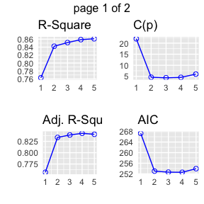
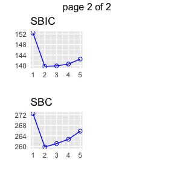

Exploring Mathematics Proficiency - Variable Selection
================
Author: Cian Mac Liatháin

# Introduction

Data obtained from a study investigating the relationship of educational
achievement of students to their home environment included measurements
for a sample of 35 school districts of average mathematics proficiency
Mathprof. In order to investigate what variables may predict mathematics
proficiency five candidate explanatory variables are considered:

- Parents, the percentage of students with both parents living at home.
- Homelib, the percentage of students with three or more types of
  reading materials at home (books, encyclopedias, magazines, newspapers
  etc),
- Reading, the percentage of students who read more than 10 pages a day.
- Tvwatch, the percentage of students who watch TV for six hours or more
  per day,
- Absences, the percentage of students absent three days or more in the
  previous month.

The aim of this report is to build a parsimonious model to predict
mathprof and to use the model to make a prediction for a district where
parents 78% of students have both parents living at home, 82% of
students have three or more types of reading materials at home reading,
36% of students read more than 10 pages a day, 14% students watch TV for
six hours or more per day and 25% students were absent three days or
more in the previous month.

# Subjective Impression

The descriptive statistics and plots below summarise the sampled
measurements.

``` r
ggpairs(mathprofdata)
```

<!-- -->

The observed Pearson correlation coefficient for the percentage of
students with both parents living at home (parents) and average
mathematical proficiency of the school district (mathprof) is 0.741.
Since this is close to 1 in magnitude and positive in value this
indicates a strong increasing linear relationship in the sample.

The observed Pearson correlation coefficient for the percentage of
students with three or more types of reading materials at home (homelib)
and average mathematical proficiency of the school district (mathprof)
is 0.745. Since this is close to 1 in magnitude and positive in value
this indicates a strong increasing linear relationship in the sample.

The observed Pearson correlation coefficient for the percentage of
students who read more than 10 pages per day (reading) and average
mathematical proficiency of the school district (mathprof) is 0.717.
Since this is close to 1 in magnitude and positive in value this
indicates a strong increasing linear relationship in the sample.

The observed Pearson correlation coefficient for the percentage of
students who watch TV for 6 hours or more per day (tvwatch) and average
mathematical proficiency of the school district (mathprof) is -0.873
Since this is close to 1 in magnitude and negative in value this
indicates a strong decreasing linear relationship in the sample.

The observed Pearson correlation coefficient for the percentage of
students who were absent 3 or more days in the previous month (absences)
and average mathematical proficiency of the school district (mathprof)
is -0.480. Since this is less than 0.5 in magnitude and negative in
value this indicates a moderate decreasing linear relationship in the
sample.

# Formal Analysis

A parsimonious model is the simplest best fitting model, the best
fitting model in which the number of explanatory variables is kept to a
minimum.

To determine which variables are in the parsimonious model a best
subsets routine is fitted, with all of the 5 predictors as candidate
predictors, to the sample data giving the following output:

``` r
models<-ols_step_best_subset(lm(mathprof~. ,data=mathprofdata))
models%>%as.data.frame%>%select(predictors)
```

                                     predictors
    4                                   tvwatch
    11                          homelib tvwatch
    22                  homelib reading tvwatch
    26          parents homelib reading tvwatch
    31 parents homelib reading tvwatch absences

``` r
plot(models)
```

<!-- --><!-- -->

The following prints values of variable selection criteria for the models
focusing on values of the coefficient of determination, Rsquare, values
of adjusted Rsquare, values of Mallow’s $C_{p}$ and values of AIC.

``` r
models%>%as.data.frame%>%select(rsquare,adjr,cp,aic)%>%round(3)
```

       rsquare  adjr     cp     aic
    4    0.763 0.757 21.993 267.305
    11   0.842 0.834  4.604 253.027
    22   0.851 0.839  4.354 252.624
    26   0.859 0.843  4.532 252.568
    31   0.861 0.841  6.000 253.947

The coefficient of determination, Rsquare, is the proportion of
variability explained in the response mathprof being explained by the
predictors in the model. The higher this value the better, this is
maximised at value 0.861 for the model with all five predictors.
However, the value of Rsquare will always increase when a predictor is
added to the model, if the additional predictor is good, Rsquare will
increase by a relatively large amount, if the predictor is poor Rsquare
will increase by a relatively small amount.

Adjusted Rsquare adds a penalty term dependent on the number of
predictors in the model:

- When adding predictor homelib to a model with tvwatch, the value of
  Rsquare has increased from 0.763 to 0.842 and adjusted Rsquare has
  increased from 0.757 to 0.834.

- When adding predictor reading to a model with tvwatch and homelib, the
  value of Rsquare has increased from 0.842 to 0.851 and adjusted
  Rsquare has increased by a small amount from 0.834 to 0.839.

- When adding predictor parents to a model with tvwatch, homelib and
  reading, the value of Rsquare has increased from 0.851 to 0.859 and
  adjusted Rsquare has increased by a small amount from 0.839 to 0.843.

- When adding predictor absences to a model with tvwatch, homelib,
  reading and parents, the value of Rsquare has increased from 0.859 to
  0.861 and adjusted Rsquare has decreased from 0.843 to 0.841.The
  additional variability explained is not enough to overpower the
  penalty for adding the predictor.

Adjusted Rsquare is maximised for model 4: predictors parents, homelib,
reading and tvwatch.

Mallows $C_{p}$ should satisfy the condition $C_{p}$ $\leq$ p+1, where p
is the number of predictors in the model. This is not satisfied for the
first three models but is satisfied for the last two models since 4.532
$\leq$ 5, 6 $\leq$ 6.

AIC is minimised for model 4: parents homelib reading tvwatch, at value
252.568.

Therefore the parsimonious model for this data is a model with four
predictor variables: parents, homelib, reading and tvwatch.

Fitting a multiple linear regression model with the four predictors in
the parsimonious model to the sample data gives the following output:

``` r
fit<-lm(mathprof~parents+homelib+reading+tvwatch,mathprofdata)
summary(fit)
```


    Call:
    lm(formula = mathprof ~ parents + homelib + reading + tvwatch, 
        data = mathprofdata)

    Residuals:
        Min      1Q  Median      3Q     Max 
    -18.244  -2.708   1.041   2.655   7.823 

    Coefficients:
                Estimate Std. Error t value Pr(>|t|)    
    (Intercept) 167.1281    32.0045   5.222 8.19e-06 ***
    parents       0.3240     0.2384   1.359   0.1829    
    homelib       0.8286     0.1719   4.819 2.76e-05 ***
    reading       0.3782     0.2662   1.421   0.1642    
    tvwatch      -0.8507     0.3501  -2.430   0.0204 *  
    ---
    Signif. codes:  0 '***' 0.001 '**' 0.01 '*' 0.05 '.' 0.1 ' ' 1

    Residual standard error: 5.233 on 35 degrees of freedom
    Multiple R-squared:  0.8589,    Adjusted R-squared:  0.8427 
    F-statistic: 53.24 on 4 and 35 DF,  p-value: 2.108e-14

Interpretation of model coefficients:

- Constant term: when all of the explanatory variables (parents,
  homelib, reading, tvwatch) have value 0, mathematical proficiency
  (mathprof) is estimated to be 167.1281 on average.

- Coefficient of parents: for each percentage increase of students in
  the school district who have both parents living at home (parents),
  mathematical proficiency increases by 0.3240 on average, holding the
  other explanatory variables (homelib, reading, tvwatch) constant.

- Coefficient of homelib: for each percentage increase of students in
  the school district with three or more types of reading materials at
  home (homelib), mathematical proficiency increases by 0.8286 on
  average, holding the other explanatory variables (parents, reading,
  tvwatch) constant.

- Coefficient of reading: for each percentage increase of students in
  the school district who read more than 10 pages per day (reading),
  mathematical proficiency increases by 0.3782 on average, holding the
  other explanatory variables (parents, homelib, tvwatch) constant.

- Coefficient of tvwatch: for each percentage increase of students in
  the school district who watch TV for 6 hours or more per day
  (tvwatch), mathematical proficiency decreases by 0.8507 on average,
  holding the other explanatory variables (parents, homelib, reading)
  constant.

- The coefficient of determination for the model with the four predictor
  variables is 0.8589, i.e. 85.89% of the variability observed in the
  response variable mathprof in the sample, is explained by the model
  with predictors parents, homelib, reading, and tvwatch.

For a school district where 78% of students have both parents living at
home, 82% of students have three or more types of reading materials at
home reading, 36% of students read more than 10 pages a day, 14%
students watch TV for six hours or more per day and 25% students were
absent three days or more in the previous month, an interval estimate is
produced for the average mathematical proficiency in the district. In
this model, only parents, homelib, reading and tvwatch measurements are
required, absences are superfulous measurements and are not required.

``` r
predict(fit, new=data.frame(parents=c(78), homelib=c(82), reading=c(36), tvwatch=c(14)), interval="prediction")
```

           fit      lwr      upr
    1 262.0515 251.2735 272.8295

For a school district that has those measurements for the four predictor
variables, the average mathematical of the students is estimated to be
between 251.2735 and 272.8295
