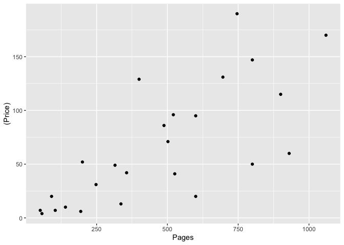
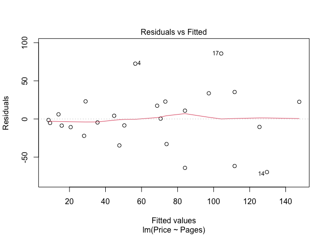
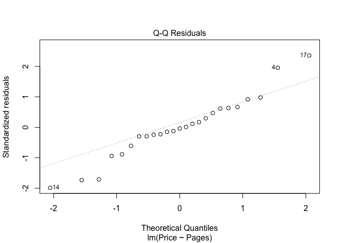
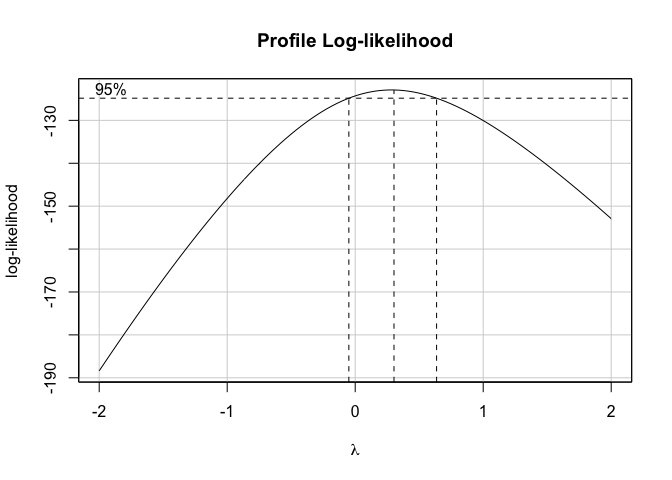

Second-hand Textbooks
================
Author: Cian Mac Liatháin

# Introduction

A University bookshop sells second-hand textbooks and wishes to build a
pricing model. Data for a sample of 25 recently sold second-hand
textbooks were recorded which included the price of the book, Price, and
the number of pages in the textbook, Pages.

The aim of this report is to build a model with number of pages as an
explanatory variable of price ensuring the assumptions underlying the
model are valid. Use the model to assess whether the number of pages is
a good predictor of price, and if so use the model to produce an
interval estimate for the price of an individual book with 100 pages.

# Subjective Impression

The descriptive statistics and plots below summarise the sampled
measurements.

``` r
ggplot(data=textbooks, aes(x=Pages, y=(Price)))+geom_point()
```

<!-- -->

``` r
cor(textbooks$Price, textbooks$Pages)
```

    [1] 0.7417089

The Pearson correlation coefficient of 0.7417089 indicates a strong
positive linear relationship between the pages in a book and its price
in the sample of 25 books. This is reflected in the increasing linear
pattern shown in the scatterplot.

# Formal Analysis

The output and diagnostic plots provided below show the results of a
simple linear regression fit of number of pages to the price of
textbooks, $Price_i=\beta_0+\beta_1Pages_i+\epsilon_i$:

``` r
model1<-lm(Price~Pages,textbooks)
summary(model1)
```


    Call:
    lm(formula = Price ~ Pages, data = textbooks)

    Residuals:
        Min      1Q  Median      3Q     Max 
    -69.595 -10.671  -1.399  22.480  85.774 

    Coefficients:
                Estimate Std. Error t value Pr(>|t|)    
    (Intercept)   1.3676    14.2969   0.096    0.925    
    Pages         0.1379     0.0260   5.303  2.2e-05 ***
    ---
    Signif. codes:  0 '***' 0.001 '**' 0.01 '*' 0.05 '.' 0.1 ' ' 1

    Residual standard error: 37.86 on 23 degrees of freedom
    Multiple R-squared:  0.5501,    Adjusted R-squared:  0.5306 
    F-statistic: 28.13 on 1 and 23 DF,  p-value: 2.205e-05

``` r
plot(model1,1)
plot(model1,2)
```



In order to use linear regression modelling of data, we are required to
make assumptions about the linearity of the data, normality of
residuals, homogeneity of residuals’ variance and independence of
residuals’ error terms.

A linear relationship is evident from the scatterplot above, as well as
from the Pearson correlation coefficient of 0.7417089 indicating a
strong positive linear relationship between the predictor and response
variables.

In our Residuals vs Fitted plot, we can see that the residuals have an
expectation of 0 on average. We can see that as the fitted values
increase, however, so does the variance of the residuals. This indicates
heteroscedasticity in our model, non-constant variance of residuals.

The Normal Q-Q plot can be used to investigate whether the residuals are
normally distributed. If the residuals are normally distributed, they
should lie along the diagonal line of equality. We can see in this
output that there is some deviation in the tails but not strong evidence
of departure from a normal distribution.

Based on the diagnostic plots above, our required assumptions are not
met using this model. The Residuals vs Fitted plot is indicating
heteroscedasticity in our model, and for this reason a different model
should be used that can allow for constant variance of the residuals.

A Box-Cox transformation can be used to determine whether, and how, a
model should be transformed.

``` r
boxCox(model1)
```



``` r
summary(powerTransform(model1))
```

    bcPower Transformation to Normality 
       Est Power Rounded Pwr Wald Lwr Bnd Wald Upr Bnd
    Y1     0.284           0      -0.0542       0.6223

    Likelihood ratio test that transformation parameter is equal to 0
     (log transformation)
                               LRT df     pval
    LR test, lambda = (0) 2.782205  1 0.095317

    Likelihood ratio test that no transformation is needed
                               LRT df      pval
    LR test, lambda = (1) 14.27079  1 0.0001583

The confidence interval for the value of $\lambda$, the power on the
response variable, $Y^{\lambda}$, is: -0.0542 \< $\lambda$ \< 0.6223.
This interval doesn’t contain $\lambda$ = 1 therefore suggests a
transformation is required. This interval does contain $\lambda$ = 0
therefore suggests a log transformation.

Based on the heteroscedasticity of the residual variances, and the
Box-Cox output, I would suggest to transform the data via a log
transformation.

``` r
model2<-lm(log(Price)~Pages,textbooks)
summary(model2)
```


    Call:
    lm(formula = log(Price) ~ Pages, data = textbooks)

    Residuals:
        Min      1Q  Median      3Q     Max 
    -1.0999 -0.6585  0.2935  0.4910  1.3655 

    Coefficients:
                 Estimate Std. Error t value Pr(>|t|)    
    (Intercept) 2.2917506  0.2825758   8.110 3.39e-08 ***
    Pages       0.0030065  0.0005139   5.851 5.81e-06 ***
    ---
    Signif. codes:  0 '***' 0.001 '**' 0.01 '*' 0.05 '.' 0.1 ' ' 1

    Residual standard error: 0.7484 on 23 degrees of freedom
    Multiple R-squared:  0.5981,    Adjusted R-squared:  0.5807 
    F-statistic: 34.23 on 1 and 23 DF,  p-value: 5.807e-06

The t-tests in the output are used to determine whether the coefficient
of the predictor variable Pages is significantly different from 0,
i.e. $H_0$: $β_1$ = 0 versus $H_a$:$β_1$ ≠ 0

The p-value of the t-test for the predictor variable Pages is small,
with p \< 0.00001, giving evidence to reject $H_0$. There is evidence to
suggest $H_a$: $β_1$ ≠ 0 i.e. the effect of the number of pages in a
book on the book’s price is significant in the population.

Using this model, an interval estimate for the price of an individual
book with 100 pages is produced.

``` r
predict(model2, new=data.frame(Pages=100), interval="prediction")
```

           fit       lwr      upr
    1 2.592396 0.9662748 4.218516

``` r
exp(predict(model2, new=data.frame(Pages=100), interval="prediction"))
```

           fit      lwr      upr
    1 13.36174 2.628136 67.93263

The price of an individual book with Pages = 100, is predicted to be
between $e^{0.9662748}$ = 2.628136 and $e^{4.218516}$ = 67.93263.
