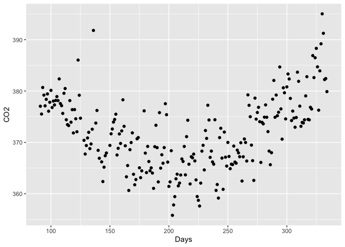
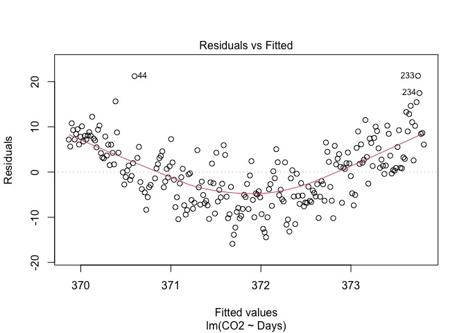
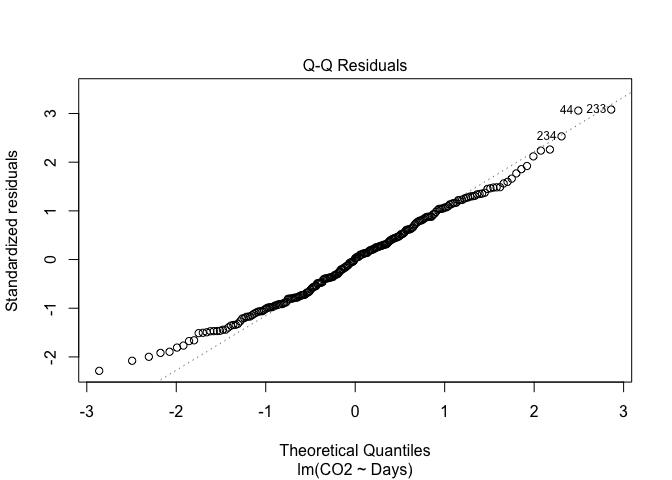
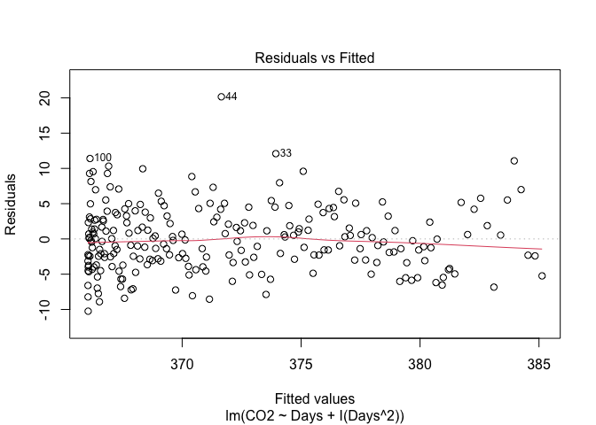
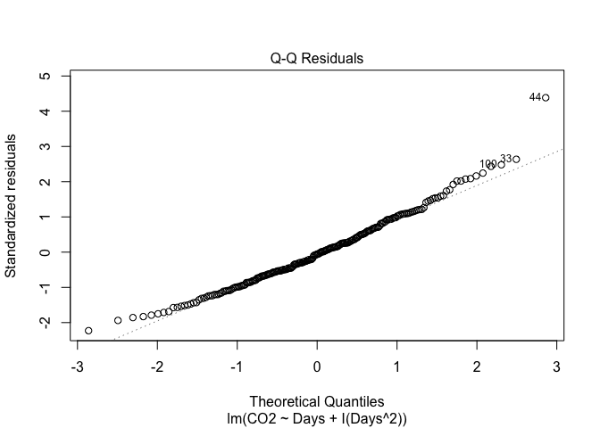

Emissions
================
Author: Cian Mac Liatháin

# Introduction

Scientists at a research station in Germany wish to build a model to
explain variability in CO2 levels in the atmosphere. They recorded the
CO2 levels, measured in parts per million, for each day from the start
of April 2001 through to November 2001, and used time as a possible
explanatory variable, defined as day of the year, i.e. observing CO2 for
days 91-334.

The aim of this report is to build a model for the relationship between
CO2 over time, i.e. using the predictor Days, and assuming that model
continues to be applicable past the time of the last observation,
predict CO2 for day 350.

# Subjective Impression

The descriptive statistics and plots below summarise the sampled
measurements.

``` r
ggplot(data=emissions, aes(x=Days, y=CO2))+geom_point()
```

<!-- -->

``` r
 cor(emissions$Days, emissions$CO2)
```

    [1] 0.162579

The Pearson correlation coefficient of 0.162579 indicates a weak linear
relationship between the predictor variable Days and response variable
CO2. This is also reflected in the scatterplot above, which indicates a
quadratic relationship between the predictor and response variables.

# Formal Analysis

A simple linear regression, $CO2_i=\beta_0+\beta_1Days_i+\epsilon_i$, is
fitted to the sample data giving the following output:

``` r
model1<-lm(CO2~Days,emissions)
summary(model1)
```


    Call:
    lm(formula = CO2 ~ Days, data = emissions)

    Residuals:
         Min       1Q   Median       3Q      Max 
    -15.8842  -5.4579   0.1714   5.0589  21.2848 

    Coefficients:
                 Estimate Std. Error t value Pr(>|t|)    
    (Intercept) 3.684e+02  1.451e+00 253.963   <2e-16 ***
    Days        1.623e-02  6.425e-03   2.526   0.0122 *  
    ---
    Signif. codes:  0 '***' 0.001 '**' 0.01 '*' 0.05 '.' 0.1 ' ' 1

    Residual standard error: 6.963 on 235 degrees of freedom
    Multiple R-squared:  0.02643,   Adjusted R-squared:  0.02229 
    F-statistic:  6.38 on 1 and 235 DF,  p-value: 0.0122

``` r
plot(model1,1)
```

<!-- -->

``` r
plot(model1,2)
```

<!-- -->

In order to use linear regression modelling of data, we are required to
make assumptions about the linearity of the data, normality of
residuals, homogeneity of residuals’ variance and independence of
residuals’ error terms.

A quadratic relationship is evident from the scatterplot above, rather
than a linear one, and the Pearson correlation coefficient of 0.162579
indicates a very weak linear relationship between the predictor variable
Days and response variable CO2.

In our Residuals vs Fitted plot we can see constant variance of the
residual, however there is a quadratic pattern evident in the pattern
rather than the radnomly distributed data points we want.

The Normal Q-Q plot can be used to investigate whether the residuals are
normally distributed. If the residuals are normally distributed, they
should lie along the diagonal line of equality. We can see in this
output the standardised residuals are strongly following the line of
equality indicating normal distribution.

Based on the diagnostic plots above, our required assumptions are not
met using this model. The Residuals vs Fitted plot is indicating a
quadratic relationship in our data, and for this reason a different
model should be used that can account for the quadratic relationship
between the predictor variable Days and response variable CO2.

``` r
model2<-lm(CO2~Days+I(Days^2),emissions)
summary(model2)
```


    Call:
    lm(formula = CO2 ~ Days + I(Days^2), data = emissions)

    Residuals:
         Min       1Q   Median       3Q      Max 
    -10.2482  -3.0799  -0.2524   2.8430  20.1527 

    Coefficients:
                  Estimate Std. Error t value Pr(>|t|)    
    (Intercept)  4.150e+02  2.856e+00  145.28   <2e-16 ***
    Days        -4.760e-01  2.874e-02  -16.57   <2e-16 ***
    I(Days^2)    1.158e-03  6.684e-05   17.32   <2e-16 ***
    ---
    Signif. codes:  0 '***' 0.001 '**' 0.01 '*' 0.05 '.' 0.1 ' ' 1

    Residual standard error: 4.619 on 234 degrees of freedom
    Multiple R-squared:  0.5734,    Adjusted R-squared:  0.5698 
    F-statistic: 157.3 on 2 and 234 DF,  p-value: < 2.2e-16

``` r
plot(model2,1)
```

<!-- -->

``` r
plot(model2,2) 
```

<!-- --> We can
see after adding the quadratic term that the Residuals vs Fitted plot
that the residuals are now showing constant variance and a randomly
scattered pattern.

Out t-tests in the summary output are testing whether the coefficients
of our predictor variables, Days and Days^2 are different than 0 in the
population. B a small p-value of 2e-16, there is evidence to reject the
null hypothesis that their true coefficient value is = 0. There is
evidence to suggest that the true coefficient of both the Days term and
the quadratic term Days^2 is different to 0, and it is needed in the
model to predict our response variable CO2.

Using this model, an interval estimate for the CO2 levels in the
atmosphere is estimated for the 350th day of the year.

``` r
predict(model2, new=data.frame(Days=350), interval="prediction")
```

           fit      lwr      upr
    1 390.1833 380.8121 399.5545

The level of C02 in the atmosphere is predicted to be between 380.121
and 399.5545 parts per million when Days = 350 i.e. on the 16th of
December.
