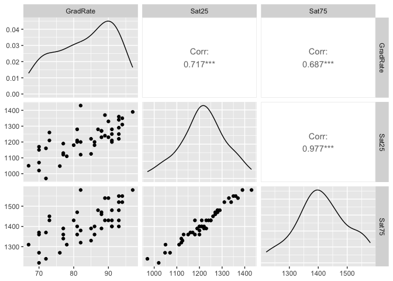

Graduation Rates
================
Author: Cian Mac Liatháin

# Introduction

Data obtained from a study exploring the relationship between graduation
rates in colleges with a number of candidate predictor variables, was
collected for a sample 45 colleges. The graduation rates, GradRate, were
recorded as % of first year students that graduated within 5 years and
two candidate predictor variables:

- Sat25, the 25th percentile SAT score of first years entering the
  college,
- Sat75, the 75th percentile SAT score of first years entering the
  college.

# Subjective Impression

The descriptive statistics and plots below summarise the sampled
measurements.

``` r
ggpairs(graduate)
```

<!-- -->

The observed Pearson correlation coefficient for the 25th percentile SAT
score of first years entering the college (Sat25) and graduation rate
(GradRate) is 0.717. Since this is close to 1 in magnitude and positive
in value this indicates a strong positive linear relationship in the
sample. This strong increasing linear relationship is reflected in the
scatterplot above.

The observed Pearson correlation coefficient for the 75th percentile SAT
score of first years entering the college (Sat75) and graduation rate
(GradRate) is 0.687. Since this is close to 1 in magnitude and positive
in value this indicates a strong positive linear relationship in the
sample. This strong increasing linear relationship is reflected in the
scatterplot above.

The observed Pearson correlation coefficient between our two predictor
variables Sat25 and Sat75 is 0.977, showing a very strong positive
linear relationship between them. This is a clear sign of
multicollinearity.This strong increasing linear relationship is
reflected in the scatterplot above.

# Formal Analysis

A linear regression model using both candidate predictors,  
$GradRate_i=\beta_0+\beta_1Sat25_i+\beta_2Sat75_i+\epsilon_i$,  
is fitted to the sample data giving the following output:

``` r
model1<-lm(GradRate~Sat25+Sat75,graduate)
summary(model1)
```


    Call:
    lm(formula = GradRate ~ Sat25 + Sat75, data = graduate)

    Residuals:
        Min      1Q  Median      3Q     Max 
    -14.779  -2.622   1.188   3.934   8.778 

    Coefficients:
                Estimate Std. Error t value Pr(>|t|)  
    (Intercept) 20.50042   20.39630   1.005   0.3206  
    Sat25        0.08211    0.04154   1.977   0.0547 .
    Sat75       -0.02604    0.04708  -0.553   0.5831  
    ---
    Signif. codes:  0 '***' 0.001 '**' 0.01 '*' 0.05 '.' 0.1 ' ' 1

    Residual standard error: 5.924 on 42 degrees of freedom
    Multiple R-squared:  0.5169,    Adjusted R-squared:  0.4939 
    F-statistic: 22.47 on 2 and 42 DF,  p-value: 2.313e-07

The ANOVA test is testing our model with a null hypothesis $H_0$ that
neither predictors Sat25 or Sat75 are explaining the variability, does
not explain the variability in the response variable GradRate in the
population: $β_1$ = $β_2$ =0. The alternative hypothesis $H_a$ concludes
that at least one of the predictor variables Sat25 and Sat75 are good
predictors and are explaining the variability in the response variable
GradRate in the population: at least one $β_1$ ≠ 0, $β_2$ ≠ 0

The ANOVA test statistics in our output is 22.47 with a p-value of
2.313e-7. Since this p-value is small, there is evidence to reject
$H_0$, there is evidence to suggest the alternative hypothesis $H_a$: at
least one of Sat25 and Sat75 are good predictors of GradRate in the
population.

The t-tests in the output are used to determine whether the coefficient
of the predictor variable Pages is significantly different from 0,
i.e. $H_0$: $β_1$ = 0 versus $H_a$:$β_1$ ≠ 0

Our t-test for the predictor variable Sat25 has a test statistics of
1.977 and a p-value of 0.0547. This p-value is not small, there is no
evidence to reject $H_0$: no evidence to suggest $H_a$:$β_1$ ≠ 0. There
is no evidence to suggest that Sat25 is a good predictor of the response
variable GradRate in the population.

Our t-test for the predictor variable Sat75 has a test statistics of
-0.553 and a p-value of 0.5831. This p-value is not small, there is no
evidence to reject $H_0$: no evidence to suggest $H_a$:$β_2$ ≠ 0. There
is no evidence to suggest that Sat75 is a good predictor of the response
variable GradRate in the population.

This contradiction between the ANOVA and t-tests, where our ANOVA test
suggests that at least one of Sat25 and Sat75 is a good predictor of
GradRate while each of their t-tests suggest no evidence that either are
good predictors, is due to to the multicollinearity highlighted earlier.
The correlation present between the predictors interferes with the
outcome of our
